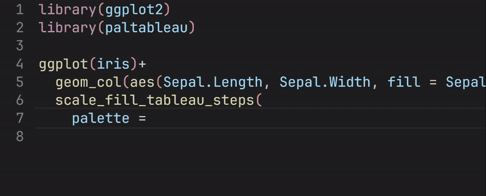

<!-- README.md is generated from README.Rmd. Please edit that file -->

```{r, include = FALSE}
knitr::opts_chunk$set(
  collapse = TRUE,
  comment = "#>",
  fig.path = "man/figures/README-",
  out.width = "100%"
)
```

# paltableau

<!-- badges: start -->
<!-- badges: end -->

This package is for quickly selecting palettes from Tableau and applying for ggplot2 objects.

## Installation

You can install the development version of paltableau like so:

``` r
# install.packages("devtools")
devtools::install_github("sToney239/paltableau")
```

## Usage

The primary functions in this package are something like `scale_fill_tableau_xxx` and `scale_color_tableau_xxx.` These functions can be used as replacements for similar functions from the `ggplot2` library.

```{r example, fig.width=5, fig.height=3}
library(ggplot2)
library(paltableau)
ggplot(iris)+
  geom_col(aes(Sepal.Length, Sepal.Width, fill = Sepal.Width))+
  scale_fill_tableau_steps2(palette = pal_tableau$diverging$red_blue_white,
                            transform = "pseudo_log",
                            midpoint = 3)
```
These functions all include a `palette` parameter, which can accept built-in palette data. These palette data typically sourced from [Tableau](https://help.tableau.com/current/pro/desktop/en-us/viewparts_marks_markproperties_color.htm), some palettes in the `sequential` category that start with "map_" are derived from [Carto](https://carto.com/carto-colors/)

## Palette selection

Palette selection can be easily accomplished using the auto-complete feature available in many R IDEs. After typing `pal_tableau`, which contains the palette color values, simply type `$` to view and select your desired palettes.


