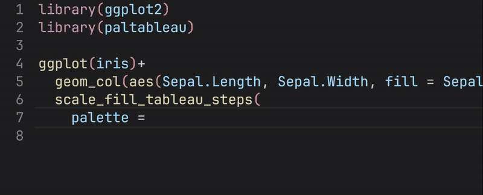

<!-- README.md is generated from README.Rmd. Please edit that file -->

# paltableau

<!-- badges: start -->

<!-- badges: end -->

This package is for quickly selecting palettes from Tableau and applying
for ggplot2 objects.

## Installation

You can install the development version of paltableau like so:

``` r
# install.packages("devtools")
devtools::install_github("sToney239/paltableau")
```

## Usage

The primary functions in this package are something like
`scale_fill_tableau_xxx` and `scale_color_tableau_xxx.` These functions
can be used as replacements for similar functions from the `ggplot2`
library.

``` r
library(ggplot2)
#> Warning: package 'ggplot2' was built under R version 4.4.3
library(paltableau)
ggplot(iris)+
  geom_col(aes(Sepal.Length, Sepal.Width, fill = Sepal.Width))+
  scale_fill_tableau_steps2(palette = pal_tableau$diverging$red_blue_white,
                            transform = "pseudo_log",
                            midpoint = 3)
```


These functions all include a `palette` parameter, which can accept
built-in palette data. The palette data typically sourced from
[Tableau](https://help.tableau.com/current/pro/desktop/en-us/viewparts_marks_markproperties_color.htm),
some palettes in the `sequential` category that start with “**map\_**”
are derived from [Carto](https://carto.com/carto-colors/)

## Palette selection

Palette selection can be easily accomplished using the auto-complete
feature available in many R IDEs. After typing `pal_tableau`, which
contains the palette color values, simply type `$` to view and select
your desired palettes.


